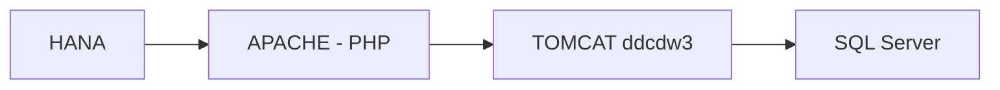

# ddc-calidad-hana2datawarehouse 
`ddcdw3`

## 📌 Descripción
API para el traspaso de información desde las tablas de HANA hacia el SQL server de David del Curto
---

## ⚙️ Tecnologías utilizadas
- Maven
- java 1.8
- Tomcat 8.5

## 🚀 Instalación

1. Generar el archvio .war
2. Instalarlo en la carpeta webapps de Tomcat

## 🔄 Flujo del sistema

## 🔗 Endpoints / Rutas API
- HANA: hana.ddc.cl:8003 (privado)
- APACHE - PHP: 10.20.1.123 (privado)
- TOMCAT (`ddcdw3`): 10.20.1.150 (privado)
- SQL SERVER: ddcbi.database.windows.net:1433

## 🧪 Request
http://10.20.1.150:8080/ddcdw3/api/update-dw
